# 1.游戏开始
## i.生成:x方先手
## ii.初始手牌5张,替换一次
## iii.选择出战角色

  

# 2.投掷阶段
## i.投与重投(卡片buff影响)

  

# 3.battle段
## i.触发battle段开始被动
## ii.玩家a操作
- 判结束状态,无点数直接进入结束,
- 支援卡
- 事件卡（立即生效）
- 装备卡（会产生联动）
- 弃卡（切元素）
- 技能（使用后结束此轮）
- 切人（非快速行动态，结束此轮）
- 主动结束

# 4.结束段
- 入2牌
- 投掷
  

# 全程observer监视

```mermaid
flowchart TB
  direction TB
  subgraph gameFlow[对局流程]
    direction TB
    gameStart([对局开始]) --> startPre
    subgraph startPre[开局准备]
      direction TB
      preStart([开局准备开始]) --> getCard
      getCard[获取手牌<br />从各自的牌堆随机获取 5 张起始手牌] --> confirmCard
      confirmCard{是否确认手牌} --是--> chooseChar
      confirmCard --否--> chooseCard
      chooseCard[选择手牌] --> confirmChangeCard
      confirmChangeCard{是否确认替换手牌} --是--> changeCard
      confirmChangeCard --否--> chooseCard
      changeCard[替换手牌<br />替换任意数量手牌] --> chooseChar
      chooseChar[选择出战角色<br />选择一张自己的角色牌作为出战角色] --> preOver
      preOver([开始准备结束])
    end
    startPre --> gameRound
    subgraph gameRound[对局回合]
      direction TB
      roundStart([回合开始]) --> throwStage
      subgraph throwStage[投掷阶段]
        direction TB
        throwStart([投掷阶段开始]) --> throwDice
        throwDice[投掷元素骰<br />获得并投掷 8 个元素骰] --> confirmDice
        confirmDice{是否确认骰子} --是--> throwOver
        confirmDice --否--> chooseDice
        chooseDice[选择元素骰<bt />选择任意数量元素骰] --> confirmReThrowDice
        confirmReThrowDice[是否确认重投骰子] --是--> reThrowDice
        confirmReThrowDice --否--> chooseDice
        reThrowDice[重投元素骰] --> throwOver
        throwOver([投掷阶段结束])
      end
      throwStage --> judgeMode
      judgeMode{是否为匹配或联机模式} --是--> 随机决定先手牌手 --> actStage
      judgeMode --否--> 玩家为先手 --> actStage
      subgraph actStage[行动阶段]
        direction TB
        actStageStart([行动阶段开始]) --> judgeFirst
        judgeFirst{是否为先手} --是--> myAct
        judgeFirst --否--> waitOppo
        waitOppo[等待对方阶段结束] --> checkMyChar
        checkMyChar{我方是否还有角色在场} --是--> myAct
        checkMyChar --否--> actStageOver
        subgraph myAct[我方行动阶段]
          direction TB
          myActStart([我方行动阶段开始]) --> fastAct
          myActStart --> fightAct
          myActStart --> annoEnd
          subgraph fastAct[快速行动]
            direction TB
            fastActStart([快速行动开始]) --> useCard
            fastActStart --> harmonyElem
            useCard[打出手牌<br />支付所需费用打出手牌] --> fastActOver
            harmonyElem[元素调和<br />丢弃一张手牌并转换一个元素骰的类型] --> fastActOver
            fastActOver([快速行动结束])
          end
          fastAct --> myActStart
          subgraph fightAct[战斗行动]
            direction TB
            fightActStart([战斗行动开始]) --> useSkill
            fightActStart --> switchChar
            useSkill[使用技能<br />支付所需费用使用出战角色的技能] --> fightActOver
            switchChar[切换角色<br />支付任意 1 个元素骰切换出战角色] --> fightActOver
            fightActOver([战斗行动结束])
          end
          fightAct --> myActOver
          annoEnd[宣布结束<br />结束本回合的行动] --> judgeOppo{对方是否已经结束}
          judgeOppo --是--> myActOver
          judgeOppo --否--> 我方获得先手 --> myActOver
          myActOver([我方行动阶段结束])
        end
        myAct --> judgeOppoChar
        judgeOppoChar{对方是否还有角色在场} --是--> judgeOppoEnd
        judgeOppoChar --否--> actStageOver
        judgeOppoEnd{对方是否已宣布结束} --是--> 对方获得先手 --> judgeMyEnd
        judgeOppoEnd --否--> waitOppo
        judgeMyEnd{我方是否已宣布结束} --是--> actStageOver
        judgeMyEnd --否--> myAct
        actStageOver([行动阶段结束])
      end
      actStage --> endStage
      subgraph endStage[结束阶段]
        direction TB
        endStageStart([结束阶段开始]) --> competeWin
        subgraph competeWin[决出胜负]
          direction TB
          competeWinStart([决出胜负阶段开始]) --> judgeOppoCharEnd
          judgeOppoCharEnd{对方是否还有角色在场} --是--> judgeMyCharEnd
          judgeOppoCharEnd --否--> 我方获得胜利 --> competeWinOver
          judgeMyCharEnd{我方是否还有角色在场} --是--> competeWinOver
          judgeMyCharEnd --否--> 对方获得胜利 --> competeWinOver
          competeWinOver([决出胜负阶段结束])
        end
        competeWin --> judgeWin
        judgeWin{是否有一方获得胜利} --是--> endStageOver
        judgeWin --否--> judgeTrigger
        judgeTrigger{是否已触发生效卡牌效果} --是--> drawCard
        judgeTrigger --否--> triggerEffect
        triggerEffect[触发场上生效的卡牌效果] --> competeWin
        drawCard[抓取手牌<br />每位牌手从自己的牌堆中抓 2 张牌] --> endStageOver
        endStageOver([结束阶段结束])
      end
      endStage --> roundOver
      roundOver([回合结束])
    end
    gameRound --> judgeWinOver
    judgeWinOver{是否有一方获得胜利} --是--> gameOver
    judgeWinOver --否--> gameRound
    gameOver([对局结束])
  end
  style gameFlow fill:#e9dfe5,stroke:#333,stroke-width:4px;
  style startPre fill:#fdeff2,stroke:#333,stroke-width:4px;
  style gameRound fill:#e4d2d8,stroke:#333,stroke-width:4px;
  style throwStage fill:#f6bfbc,stroke:#333,stroke-width:4px;
  style actStage fill:#f5b1aa,stroke:#333,stroke-width:4px;
  style myAct fill:#f5b199,stroke:#333,stroke-width:4px;
  style fastAct fill:#efab93,stroke:#333,stroke-width:4px;
  style fightAct fill:#f2a0a1,stroke:#333,stroke-width:4px;
  style endStage fill:#f0908d,stroke:#333,stroke-width:4px;
  style competeWin fill:#fdeff2,stroke:#333,stroke-width:4px;
```

